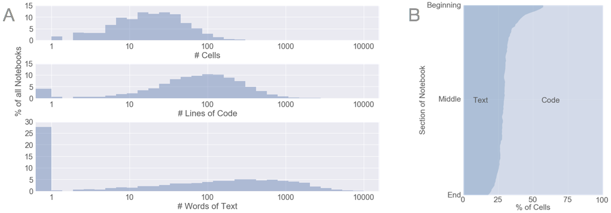
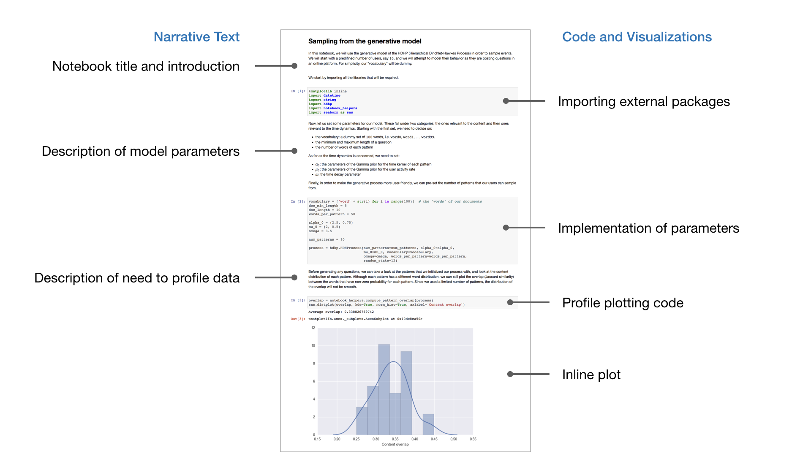

# Jupyter Notebooks on Github
In July 2017 we searched for, downloaded, and analyzed the approximately 1.3
million public Jupyter Notebooks on Github at the time. This repository includes
the notebooks used to query and analyze that dataset. We are working on making the
raw notebook data (about 600 Gb) available for public use.

In our analysis, we looked primarily at how notebooks employ narrative (operationalized as
markdown text). Our main finding was that many notebooks (~27%) include no
markdown text and that text occurs more often at the start of notebooks.

See our forthcoming [CHI 2018 publication](http://adamrule.com/files/papers/chi_2018_computational_notebooks_camera_ready.pdf) for a more detailed description of this
analysis, as well as our related study of notebooks published alongside
academic publications and interviews with academic data analysts.

For those unfamiliar with Jupyter Notebooks, they are an interactive computing
environment that enable analysts to combine code, visualizations, and text in a
single, easily shared document. See the example of a notebook below:

